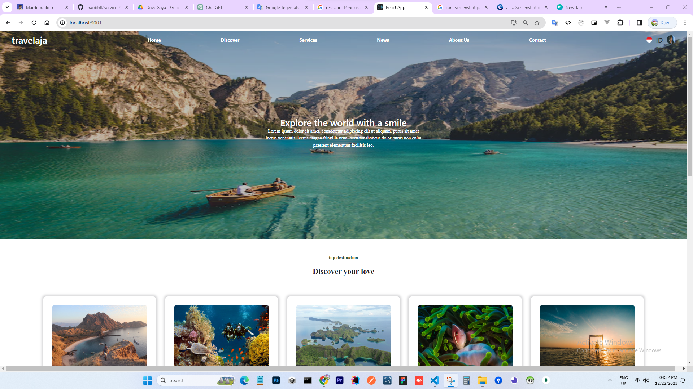
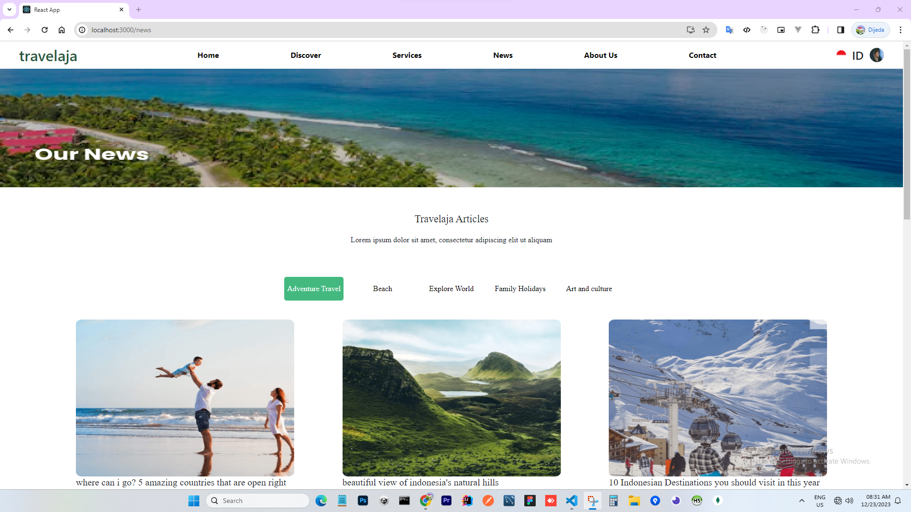
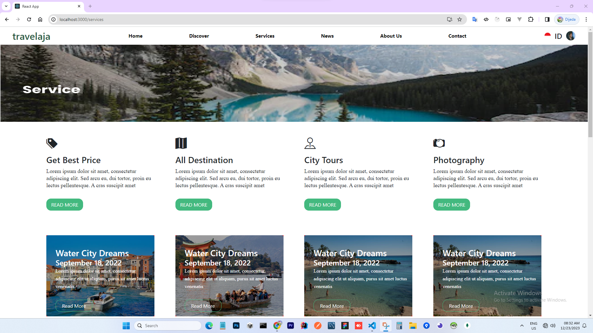

## [Travel-Web](https://github.com/mardibll/Travel-Web.git)

This travel application is a type of web application used to help clients plan, book and manage their trips. This application mainly contains various recommendations for interesting tourist destinations.

### Features

```sh
- List
```

### Skills Used

```sh
- React-Js
- Redux
- Redux-Saga
- Bootstrap
```

<p align="center">
     
     
     
</p>
